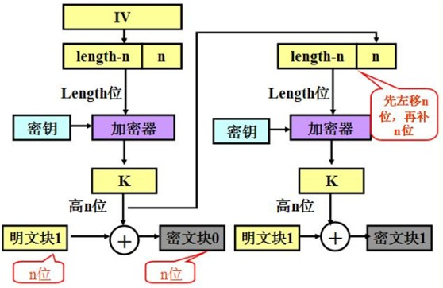

# crypt Mode 加密分组模式

## ECB模式（默认）： 电码本模式 Electronic Codebook Book  

最基本的加密模式，也就是通常理解的加密，相同的明文将永远加密成相同的密文，无初始向量，容易受到密码本重放攻击，一般情况下很少用。

### ECB优点

1. 简单
2. 有利于并行计算
3. 误差不会被传送

### ECB缺点

1. 不能隐藏明文的模式；
2. 可能对明文进行主动攻击。

## CBC模式： 密码分组链接模式    Cipher Block Chaining  

明文被加密前要与前面的密文进行异或运算后再加密，因此只要选择不同的初始向量，相同的密文加密后会形成不同的密文，这是目前应用最广泛的模式。CBC加密后的密文是上下文相关的，但明文的错误不会传递到后续分组，但如果一个分组丢失，后面的分组将全部作废(同步错误)。

### CBC优点

1. 不容易主动攻击,安全性好于ECB,适合传输长度长的报文,是SSL、IPSec的标准。

### CBC缺点

1. 不利于并行计算；
2. 误差传递；
3. 需要初始化向量IV。

## CFB模式： 密码反馈模式    Cipher FeedBack  

类似于自同步序列密码，分组加密后，按8位分组将密文和明文进行移位异或后得到输出同时反馈回移位寄存器，优点最小可以按字节进行加解密，也可以是n位的，CFB也是上下文相关的，CFB模式下，明文的一个错误会影响后面的密文(错误扩散)。

### CFB优点

1. 隐藏了明文模式；
2. 分组密码转化为流模式；
3. 可以及时加密传送小于分组的数据。

### CFB缺点

1. 不利于并行计算；
2. 误差传送：一个明文单元损坏影响多个单元；
3. 唯一的IV。

## OFB模式： 输出反馈模式    Output FeedBack  

将分组密码作为同步序列密码运行，和CFB相似，不过OFB用的是前一个n位密文输出分组反馈回移位寄存器，OFB没有错误扩散问题。

### 优点

1. 隐藏了明文模式；
2. 分组密码转化为流模式；
3. 可以及时加密传送小于分组的数据。

### 缺点

1. 不利于并行计算；
2. 对明文的主动攻击是可能的；
3. 误差传送：一个明文单元损坏影响多个单元。

## CTR模式： 计算器模式    Counter  

通过递增一个加密计数器以产生连续的密钥流，其中，计数器可以是任意保证长时间不产生重复输出的函数，但使用一个普通的计数器是最简单和最常见的做法。CTR模式的特征类似于OFB，但它允许在解密时进行随机存取。由于加密和解密过程均可以进行并行处理，CTR适合运用于多处理器的硬件上。
