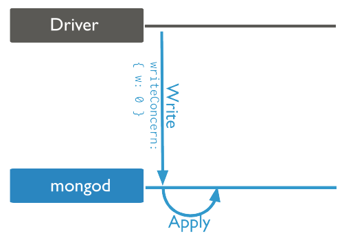
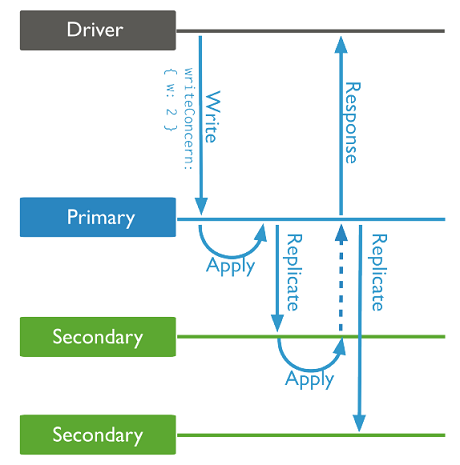

# mongodb 副本集 (复制+选举)

## 意义

1. 服务高可用
2. 数据分发 全球跨区域复制，用户访问临近节点
3. 读写分离
4. 异地容灾

## 复制

- v 是否有选举权
- priority 优先级 主数据中心调高，备份中心调低
- hidden 隐藏 备份时用
- slaveDelay 延迟 防止误操作删除数据

## 选举

1. 具有`投票权`的节点之间两两互发心跳
2. 当5次心跳未收到则判定为节点失联
   1. primary失联，则secondary发起选举
   2. secondary失联，无选举
3. 选举基于[raft](algo-raft.md)一致性算法，选举成功必要条件是大多数投票节点存货。
4. 最多存在50个节点，但`投票权`的节点最多7个

## 节点  

Primary  
Secondary  

- Secondary: 普通从节点，可被选为主节点，以下都是特殊从节点。  
- Arbiter(不推荐): arbiter节点只参与投票，不能被选为Primary，并且不从Primary同步数据  
- Priority0: priority0节点的选举优先级为0，不会被选举为Primary  
- Vote0: vote0节点不参与投票 (复制集成员最多50个，参与Primary选举投票的成员最多7个， 其他成员都是Vote0)  
- Hidden: hidden节点不能被选为主（Priority为0），并且对Driver不可见。(可使用Hidden节点做一些数据备份、离线计算的任务)  
- Delayed: delayed节点必须是Hidden节点，并且其数据落后与Primary一段时间  
  
| 节点类型   | 可读 | 可写 | 投票 | oplog操作 | 当选primary | 否决 | 备注               |
| :--------- | :--- | :--- | :--- | :-------- | :---------- | :--- | :----------------- |
| primary    | O    | O    | O    | 生成      | -           | O    | -                  |
| secondary  | O    | X    | O    | 同步      | O           | O    | 常规的seconday     |
| Priority=0 | O    | X    | O    | 同步      | X           | O    | -                  |
| Hidden     | X    | X    | O    | 同步      | X           | O    | Priority=0，不可见 |
| Delayed    | X    | X    | O    | 同步      | X           | O    | 为Hidden，延迟同步 |
| Arbiter    | X    | X    | O    | X         | X           | O    | Priority=0，无数据 |
| vote=0     | O    | X    | X    | 同步      | O           | O    | 不能投票           |

> 客户端一般会保持连接多个实例（主从从从选...都有连接），以确保主挂后可以从其他实例拿到最新的副本集状态，进而连接到新的主节点。(若只连接主，主跪了，客户端便不能得到任何服务)  
  
## 选举因素

健康监测  

- 节点间心跳  

节点优先级  

- 投票给优先级最高的节点  
- 优先级为0的节点不会主动发起选举  
- 当Primary发现有优先级更高Secondary，并且该Secondary的数据落后在10s内，则Primary会主动降级，让优先级更高的Secondary有成为Primary的机会。  

拥有较新的oplog  

- 拥有最新optime（最近一条oplog的时间戳）的节点才能被选为主。  

多数派连接  

- 一个member要成为primary，它必须与“多数派”的其他members建立连接，如果未能与足够多的member建立连接，事实上它本身也无法被选举为primary；多数派参考的是“总票数”，而不是member的个数，因为我们可以给每个member设定不同的“票数”。假设复制集内投票成员数量为N，则大多数为 N/2 + 1。  

## 读策略 Read Preference  

primary(默认)： 所有读请求发到Primary  
primaryPreferred： Primary优先，如果Primary不可达，请求Secondary  
secondary： 所有的读请求都发到secondary  
secondaryPreferred：Secondary优先，当所有Secondary不可达时，请求Primary  
nearest：读请求发送到最近的可达节点上（通过ping探测得出最近的节点）  

## 写策略 Write Concern

  
非应答写入Unacknowledged  - `{writeConcern:{w:0}}`  

- MongoDB不对客户端进行应答，驱动会检查套接字，网络错误等。  

  

应答写入Acknowledged(默认)  - `{writeConcern:{w:1}}`  

- MongoDB会在收到写入操作并且确认该操作在内存中应用后进行应答，但不会确认数据是否已写入磁盘;同时允许客户端捕捉网络、重复key等等错误  

  

应答写入+journal写入Journaled  - `{writeConcern:{w:1, j:true}}`  

- 确认写操作已经写入journal日志(持久化)之后应答客户端，必须允许开启日志功能，才能生效。  
- 写入journal操作必须等待直到下次提交日志时完成写入  
- 提供通过journal来进行数据恢复  

  

副本集应答写入Replica Acknowledged   - `{writeConcern:{w:2, wtimeout:5000}}`  - `{writeConcern:{w:majority, wtimeout:5000}}`  

- 对于使用副本集的场景，缺省情况下仅仅从主(首选)节点进行应答  
- 可修改应答情形为特定数目或者majority(写到大多数)来保证数据的可靠  
  - primary是如何确认数据已成功写入大多数节点的？
    1. 从节点及时地拉取数据: 阻塞拉取  
       - 从拉取主的oplog时， 为了第一时间拉取，find命令支持一个awaitData的选项，当find没有任何符合条件的文档时，并不立即返回，而是等待最多maxTimeMS(默认为2s)时间看是否有新的符合条件的数据，如果有就返回。  
    2. 主节点同步拉取状态: Secondary应用完oplog会向主报告最新进度  
       - Secondary上有单独的线程，当oplog的最新时间戳发生更新时，就会向Primary发送replSetUpdatePosition命令更新自己的oplog时间戳。(即：)  
    3. 当Primary发现有足够多的节点oplog时间戳已经满足条件了，向客户端进行应答。  
