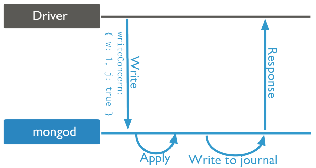

# mongodb  
  
## 日常命令 cmd  
  
## [index 索引](mongodb-index.md)

### 原理  

btree和hash  
  
### 场景  

读多写少  
  
### 类型  

Single Field Index 单字段索引：  
Compound Index 复合索引：多字段联合索引，注意顺序（a,b,c创建复合索引，查a,b时索引有效，查b，c时索引无效）  
Multikey Index 多key索引： 数组值索引  
hash 哈希索引：是指按照某个字段的hash值来建立索引，目前主要用于 MongoDB Sharded Cluster 的Hash分片，hash索引只能满足字段完全匹配的查询，不能满足范围查询等。  
Geospatial Index 地理索引：能很好的解决O2O的应用场景，比如『查找附近的美食』、『查找某个区域内的车站』等。  
Text Index 文本索引：能解决快速文本查找的需求，比如有一个博客文章集合，需要根据博客的内容来快速查找，则可以针对博客内容建立文本索引。  
额外索引属性  

- unique index 唯一索引  
- TTL索引： 指定数据失效时间  
- partial index 部分索引： 只针对符合某个特定条件的文档建立索引  
- sparse index 稀疏索引： 只针对存在索引字段的文档建立索引，可看做是部分索引的一种特殊情况  

### 优化  

开启profiling慢查询，找到需要优化的请求  

- db.setProfilingLevel(1, 100); // 0 不开启 1 开启慢查询 2 记录所有  
  
explain分析索引  
  
## aggregation 聚合  

阶段操作符  

- $count, $project, $match, $group, $sort, $limit, $unwind  
  
`db.mycol.aggregate([{group: {_id: 'sex', personCount: {$sum: 1}}}])`  
  
## sync 同步

initial sync 全量同步  
oplog 增量同步  

- Primary上的写操作完成后，会向特殊的local.oplog.rs特殊集合写入一条oplog，Secondary不断的从Primary取新的oplog并应用  
  
## replica set 副本集

### 节点  

Primary  
Secondary  

- Secondary: 普通从节点，可被选为主节点，以下都是特殊从节点。  
- Arbiter: arbiter节点只参与投票，不能被选为Primary，并且不从Primary同步数据  
- Priority0: priority0节点的选举优先级为0，不会被选举为Primary  
- Vote0: vote0节点不参与投票 (复制集成员最多50个，参与Primary选举投票的成员最多7个， 其他成员都是Vote0)  
- Hidden: hidden节点不能被选为主（Priority为0），并且对Driver不可见。(可使用Hidden节点做一些数据备份、离线计算的任务)  
- Delayed: delayed节点必须是Hidden节点，并且其数据落后与Primary一段时间  
  
| 节点类型   | 可读 | 可写 | 投票 | oplog操作 | 当选primary | 否决 | 备注               |  
| :--------- | :--- | :--- | :--- | :-------- | :---------- | :--- | :----------------- |  
| primary    | O    | O    | O    | 生成      | -           | O    | -                  |  
| secondary  | O    | X    | O    | 同步      | O           | O    | 常规的seconday     |  
| Priority=0 | O    | X    | O    | 同步      | X           | O    | -                  |  
| Hidden     | X    | X    | O    | 同步      | X           | O    | Priority=0，不可见 |  
| Delayed    | X    | X    | O    | 同步     | X           | O    | 为Hidden，延迟同步 |  
| Arbiter    | X    | X    | O    | X         | X           | O    | Priority=0，无数据 |  
| vote=0     | O    | X    | X    | 同步      | O           | O    | 不能投票           |  

> 客户端一般会保持连接多个实例（主从从从选...都有连接），以确保主挂后可以从其他实例拿到最新的副本集状态，进而连接到新的主节点。(若只连接主， 主跪了，客户端便不能得到任务服务)  
  
### 选举因素

健康监测  

- 节点间心跳  

节点优先级  

- 投票给优先级最高的节点  
- 优先级为0的节点不会主动发起选举  
- 当Primary发现有优先级更高Secondary，并且该Secondary的数据落后在10s内，则Primary会主动降级，让优先级更高的Secondary有成为Primary的机会。  

optime  

- 拥有最新optime（最近一条oplog的时间戳）的节点才能被选为主。  

多数派连接  

- 一个member要成为primary，它必须与“多数派”的其他members建立连接，如果未能与足够多的member建立连接，事实上它本身也无法被选举为primary；多数派参考的是“总票数”，而不是member的个数，因为我们可以给每个member设定不同的“票数”。假设复制集内投票成员数量为N，则大多数为 N/2 + 1。  

### 读策略 Read Preference  

primary(默认)： 所有读请求发到Primary  
primaryPreferred： Primary优先，如果Primary不可达，请求Secondary  
secondary： 所有的读请求都发到secondary  
secondaryPreferred：Secondary优先，当所有Secondary不可达时，请求Primary  
nearest：读请求发送到最近的可达节点上（通过ping探测得出最近的节点）  

### 写策略 Write Concern

  
非应答写入Unacknowledged  - `{writeConcern:{w:0}}`  

- MongoDB不对客户端进行应答，驱动会检查套接字，网络错误等。  

  

应答写入Acknowledged(默认)  - `{writeConcern:{w:1}}`  

- MongoDB会在收到写入操作并且确认该操作在内存中应用后进行应答，但不会确认数据是否已写入磁盘;同时允许客户端捕捉网络、重复key等等错误  

  

应答写入+journal写入Journaled  - `{writeConcern:{w:1, j:true}}`  

- 确认写操作已经写入journal日志(持久化)之后应答客户端，必须允许开启日志功能，才能生效。  
- 写入journal操作必须等待直到下次提交日志时完成写入  
- 提供通过journal来进行数据恢复  

  

副本集应答写入Replica Acknowledged   - `{writeConcern:{w:2, wtimeout:5000}}`  - `{writeConcern:{w:majority, wtimeout:5000}}`  

- 对于使用副本集的场景，缺省情况下仅仅从主(首选)节点进行应答  
- 可修改应答情形为特定数目或者majority(写到大多数)来保证数据的可靠  
  - primary是如何确认数据已成功写入大多数节点的？
    1. 从节点及时地拉取数据: 阻塞拉取  
       - 从拉取主的oplog时， 为了第一时间拉取，find命令支持一个awaitData的选项，当find没有任何符合条件的文档时，并不立即返回，而是等待最多maxTimeMS(默认为2s)时间看是否有新的符合条件的数据，如果有就返回。  
    2. 主节点同步拉取状态: Secondary应用完oplog会向主报告最新进度  
       - Secondary上有单独的线程，当oplog的最新时间戳发生更新时，就会向Primary发送replSetUpdatePosition命令更新自己的oplog时间戳。(即：)  
    3. 当Primary发现有足够多的节点oplog时间戳已经满足条件了，向客户端进行应答。  
  
## mongos (router)  
  
## shard 分片  

### 组成  

config  

- 用来保存数据，保证数据的高可用性和一致性。可以是一个单独的mongod实例，也可以是一个副本集。在生产环境下Shard一般是一个Replica Set，以防止该数据片的单点故障。可以将所有shard的副本集放在一个服务器多个mongodb实例中。  
  
router  

- 路由就是mongos的实例，客户端直接连接mongos，由mongos把读写请求路由到指定的Shard上去。  
- 一个Sharding集群，可以有一个mongos，也可以如上图所示为每个App Server配置一个mongos以减轻路由压力。  
- 注意这里的mongos并不要配置为rs，因为只是个路由，并不存储数据，配置多个mongos的意思是配置多个单独的mongos实例。  

shards  

- 用来保存数据，保证数据的高可用性和一致性。可以是一个单独的mongod实例，也可以是一个副本集。在生产环境下Shard一般是一个Replica Set，以防止该数据片的单点故障。可以将所有shard的副本集放在一个服务器多个mongodb实例中。  
  
### 分片键 Shard keys  

### 优点  

读写方面： sharding将读写负载均匀到各个shard，且workload上限可以通过水平扩展来增加。  
扩容方面： 每个shard保存一部分数据，可以通过增加shards来扩容。  
高可用方面： 即便某个shard不可用了，整个集群也可以对外提供服务，只不过访问down掉的shard会报"Connection refused"的错误。而且MongoDB3.2以后可以为每个shard都配置副本集（replica set），这样保证最大程度的高可用性。  

### 缺点  

数据量较少时不建议使用sharding，毕竟读写都要经过一层路由会有性能损耗，直接表现就是ips和qps会降低。  

### 额外  

sharding集群不支持一些常规的单实例方法，如group()，可以使用mapReduce()或者aggregate()中的group来替代，因此建议从一开始学习就直接使用aggregate(),这种写法较为简单明了，且统一化易于识别。  
对于没有用到shard key的查询，路由进行全集群广播（broadcast operation），对每个shard都查一遍进行scatter/gather，此时效率会很低。  

### 策略  

hash  
ranged  
  
## capped collection

定义  

- Capped Collection是性能出色的有着固定大小的集合，以LRU（least Recently Used，最近最少使用）规则和插入顺序执行age-out（老化移出）处理，自动维护集合中对象的插入顺序。多用以日志归档。  
  
Notice  

- 如果写比读多，最好不要在上面创建索引
- 使用natual ordering可以有效地检索最近插入的元素，因为capped collection能够保证自然排序就是插入的顺序。  
- capped collection不能被shard.  
- 可以在创建capped collection时指定collection中能够存放的最大文档数。  
  
实现  

- oplog
  
## 备份回档  
  
## 实战  

### 输出全部结果

```js  
// dump.js  
var c = db.coll.find({status:1}).limit(5)  
while(c.hasNext()) {  
    printjson(c.next());  
}  
//mongo 127.0.0.1:27017/db1 dump.js> result.js  
```  
  
### 查询最后插入的数据

```js  
db.coll.find().limit(1).sort({$natural:-1})  
db.coll.find().skip(db.coll.count()-1).forEach(printjson)  
```  
  
### 查询文档的keys

```js  
for(var key in db.coll.findOne({_id:"xxx"})) {print (key)}  
```  
  
### 查询内嵌embedded文档的keys TODO  
  
### doc size

```js  
Object.bsonsize(db.coll.findOne({type:"auto"}))  
```

## issue

### 单个doc 16M限制
