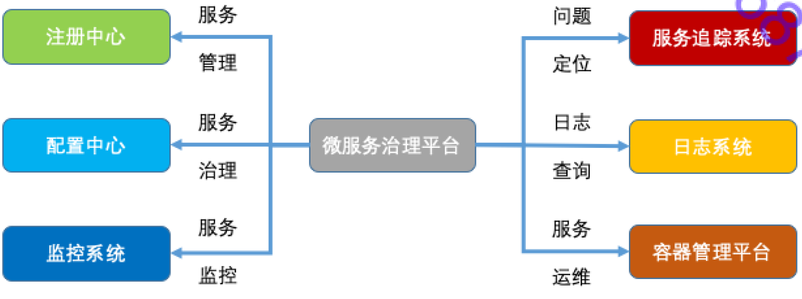

# 微服务 服务治理

## 节点管理

- **注册中心主动摘除机制** s主动向r汇报心跳，心跳超时则r摘除该节点，并将可用s节点列表推送给c。
  - 问题1 若r与s网络故障导致心跳超时，但s是能正常提供服务的，最差会导致r将s全部摘除 （雪崩）
  - 解决1 设置阈值，如20%，一段时间内r不能摘除超过20%以上的节点。
  - 问题2 网络抖动导致可用节点不断变化，大量c全量获取节点信息，打满带宽。
  - 解决2 设置开关，开启时，即使网络抖动，r也不会通知所有c，只给10%返回节点信息，但这样会c感知节点信息的延迟加大。
- **服务消费者摘除机制** c对s进行存货探测，心跳超时则标记该s节点不可用(仅标记在c自己内存)。

## 负载均衡

- **随机** 均匀
- **加权轮询** 按硬件性能合理分配权重轮询
- **最少活跃** 以连接数选择调用最少节点
- **一致性hash** 相同参数的请求总发向同一节点，某扩缩容或节点故障时，原发往该节点的请求平摊到其他节点，不会引起剧烈变动。

- **自适应最优算法（动态加权轮询）** c端维护一份与每个s的性能统计，动态的将性能低的权重设低值，性能好的权重设高值。

## 路由

### 路由 - 场景

- **业务灰度发布需求** 新功能部分用户先访问，得到反馈后全量发布
- **多机房就近访问需求** 跨IDC多机房；异地多活
- **流量切换** 不可抗力的故障，将故障的a机房流量切换到安全的b机房
- **读写分离** 读、写部署在不同的节点

### 路由 - 规则

- **条件路由**
  - c与s映射 `host = 1.1.1.1 => host = 2.2.2.2`
  - 排除s节点；所有访问不落在该IP `=> host != 1.1.1.1` 如：线上排除预发布机器
  - 黑名单；该IP不可访问 `host = 1.1.1.1, 2.2.2.2 =>`
  - 白名单；仅该IP可访问 `host != 1.1.1.1, 2.2.2.2 =>`
  - 机房隔离； `host = 1.1.1.* => host = 1.1.1.*` 如：同IP端一般为同地机房
  - 读写分离； `method = find*, list*, get* => host = 1.1.1.1` `method != find*, list*, get* => host = 2.2.2.2`
- **脚本路由**
  - JS、Python、golang等脚本路由

### 路由 - 方式

- **静态配置** c存储路由规则
- **动态配置** r存储路由规则

### 路由 - 获取

- **本地配置**
- **动态下发**
- **配置中心**

## 容错

- **FailOver** 失败自动切换 自动从可用节点选择下一节点请求
  - 场景 幂等、一般是读请求
- **FailBack** 失败通知 不重试，只给通知
  - 场景 非幂等
- **FailCache** 失败缓存 不立刻重试，而是隔一段时间再发起重试。
  - 场景 幂等、立刻重试可能会加剧问题。
- **FailFast** 快速失败 不重试
  - 场景 非核心业务

## 故障

- **集群故障** bug使资源消耗，承载下滑； 突发流量冲击，系统压垮。
  - 限流
    - 方式 给系统或服务设置并发请求量阈值，超过则抛弃。
    - 标准 QPS； 线程数
  - 降级
    - 方式 设置开关
    - 标准 新增的业务； 按程度降级（如：1级影响业务小 可自动； 2级影响业务 需手动； 3级对业务、收入、体验较大影响 手动）
- **单IDC故障**
  - 基于DNS切换流量
  - 基于RPC切换流量
    - 方式 修改路由
- **单机故障**
  - 重启
    - 方式 判定服务不可用，摘除，自动重启，重新上线。
    - 标准 某接口平均耗时低于阈值则重启； 多接口采集平均耗时低于阈值则重启。

## 调用失败

- **设置超时**
  - 场景 服务调用迟迟没有返回结果，可能将c端连接消耗殆尽。
- **重试**
  - 场景 服务调用失败偶发。
- **双发** 同时发出两次调用，提高成功率和效率（接收先返回的结果）； 备份请求(backup requests)：先调用，超时时间P999，没返回再发一个调用，超时P90。
  - 场景 服务调用失败偶发。
  - 优化 备份请求要设置一个最大重试比例，以避免增大压力，如：15%的请求进行双发。
- **熔断** 某段时间内调用失败次数达到阈值，触发熔断，后续调用直接返回异常。
  - 场景 s端故障短时间无法恢复。

## 配置中心

- **本地配置** 修改配置需要进行发布，是很重的操作
  - 耦合 配置在代码库中，随代码一同发布
  - 独立 抽离到单独库，配置与代码分离
- **配置中心** 把服务配置、代码开关、服务降级开关、依赖资源等同一管理
  - 存储结构
  - 注册
  - 反注册
  - 查看
  - 订阅变更

## 服务治理平台

- **服务管理**
  - 服务上下线
  - 添加删除节点
  - 服务查询
  - 服务节点查询
- **服务治理**
  - 限流
  - 降级
  - 切流量
- **服务监控**
- **问题定位**
- **日志查询**
- **服务运维**
  - 发布
  - 扩缩容

## ISSUES

- r宕机
- s宕机
- c与r网络故障
- s与r网络故障
- c与s网络故障
- s性能变慢
- s短时间内不可用
