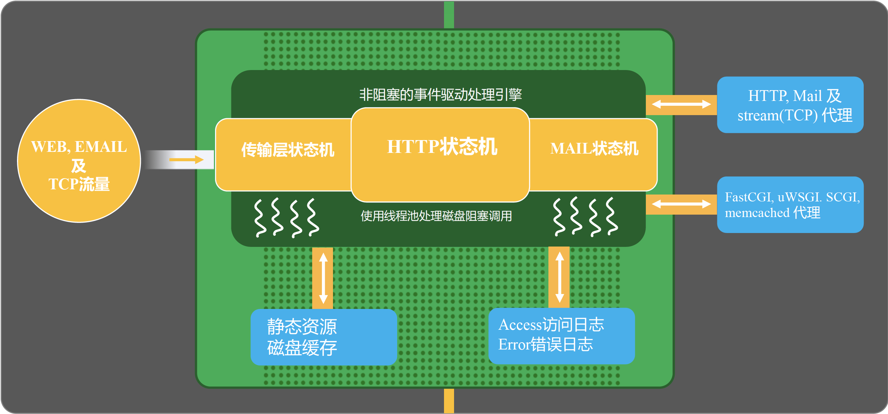
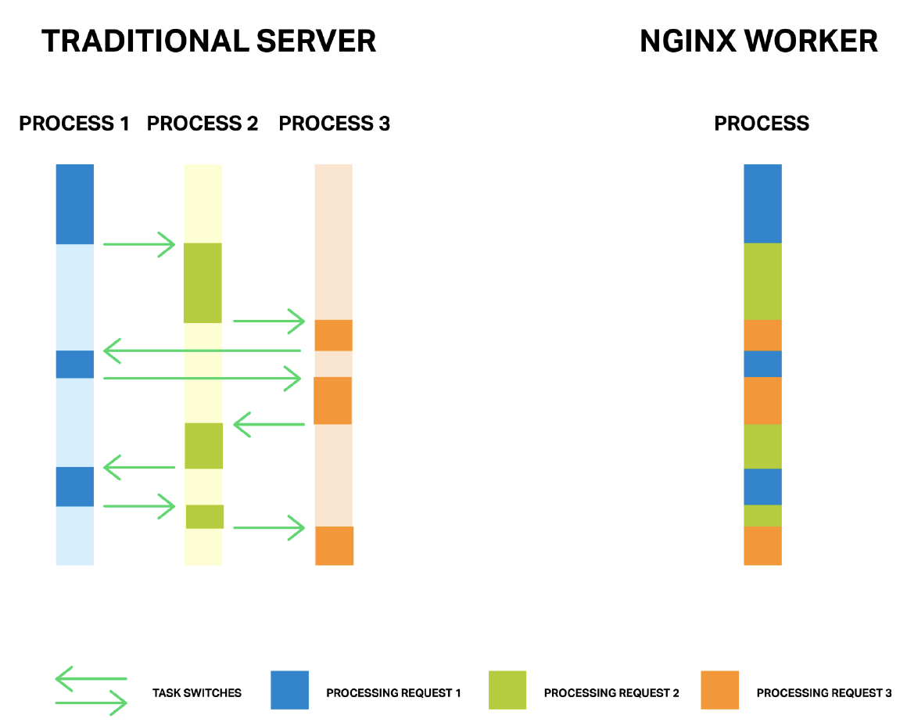

# nginx arch

## 架构

### 主进程
Nginx启动时，会生成两种类型的进程，一个是主进程（ master ），一个（ windows版本的目前只有一个）或多个工作进程（ worker ）。 主进程并不处理网络请求，主要负责调度工作进程 ，也就是图示的3项： 加载配置、启动工作进程及非停升级。所以，Nginx启动以后，查看操作系统的进程列表，我们就能看到至少有两个Nginx进程。

### 工作进程
服务器实际处理网络请求及响应的是工作进程（worker），在类unix系统上，Nginx可以配置多个worker，而每个worker进程都可以同时处理数以千计的网络请求。

### 模块化设计
Nginx的worker进程，包括核心和功能性模块，核心模块负责维持一个运行循环（run-loop），执行网络请求处理的不同阶段的模块功能，比如：网络读写、存储读写、内容传输、外出过滤，以及将请求发往上游服务器等。而其代码的模块化设计，也使得我们可以根据需要对功能模块进行适当的选择和修改，编译成具有特定功能的服务器。

### 事件驱动模型
基于异步及非阻塞的事件驱动模型，可以说是Nginx得以获得高并发、高性能的关键因素，同时也得益于对Linux、Solaris及类BSD等操作系统内核中事件通知及I/O性能增强功能的采用，如kqueue、epoll及event ports。

### 代理（proxy）设计
代理设计，可以说是Nginx深入骨髓的设计，无论是对于HTTP，还是对于FastCGI、Memcache、Redis等的网络请求或响应，本质上都采用了代理机制。所以，Nginx天生就是高性能的代理服务器。

## 进程模型
### master / worker 多进程模型

1. 主程序 Master process 启动后，通过一个 for 循环来接收和处理外部信号  
2. 主进程通过 fork() 函数产生 worker 子进程 ，每个子进程执行一个 for 循环来实现 Nginx 服务器对事件的接收和处理 。
3. 每个worker一个线程，用户态完成切换，避免OS进程间切换损耗（如apache）。

## 交互
### 外界 - master/worker 进程交互
### master - worker 进程交互
### worker - worker 进程交互
### worker - master 进程交互
### oldmaster - newmaster 进程交互

## 实战
推荐worker**进程数与CPU内核数一致**。避免了进程之间竞争CPU资源和进程切换的开销

nginx提供了**CPU亲缘性的绑定选项**，一个进程绑定在某一个核上，这样就不会因为进程的切换带来Cache的失效。  

