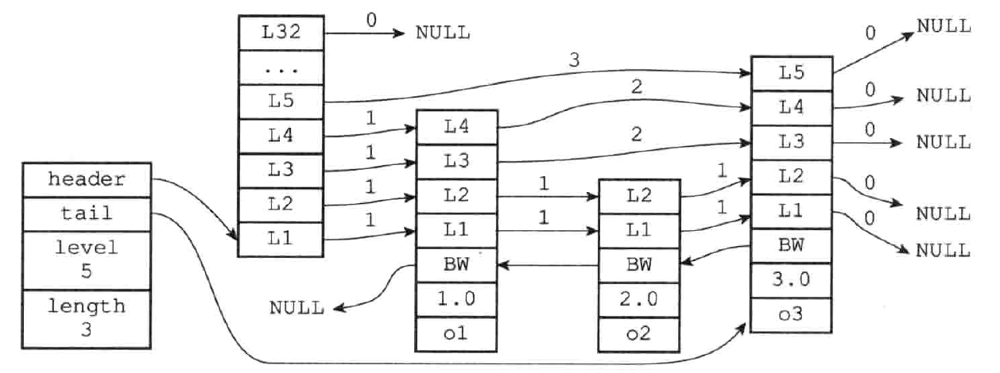

# redis 编码 skiplist

OBJ_ENCODING_SKIPLIST

## 作用于

OBJ_ZSET, 集群节点

## source code

src/server.h

## 数据结构



```c
// 跳跃表
typedef struct zskiplist {
    struct zskiplistNode *header, *tail; // 指向跳跃表头、尾
    unsigned long length;                // 长度。即跳跃表包含节点的数量（表头节点不算在内）
    int level;                           // 跳跃表内层数最大的节点的层数（表头节点的层数不算在内）
} zskiplist;

// 跳跃表节点
typedef struct zskiplistNode {
    sds ele;                            // 节点成员值(member)
    double score;                       // 节点分值 默认节点间从小到大排列; 注意double类型 即十进制15位精度。
    struct zskiplistNode *backward;     // 当前节点的前一个节点
    struct zskiplistLevel {             // 多层 其中每个元素是1层
        struct zskiplistNode *forward;      // 前进指针
        unsigned long span;                 // 跨度 跨越节点数
    } level[];
} zskiplistNode;
```

### 层

加快访问其他节点的速度，一般层越多越快，层高在1~32随机的

### 跨度

节点间的距离，即排位。

> 前进节点=NULL则跨度=0；前进节点有值则至少跨度=1  

### 前进指针

用于遍历

### 后退指针

用于逆向遍历

### 分值和成员

成员互斥，分值可相同。分值相等时，按成员排序。

## 特性

## API

| 函数名称              | 作用                                                   | 复杂度                                                            |
| --------------------- | ------------------------------------------------------ | ----------------------------------------------------------------- |
| zslCreate             | 创建一个新的跳跃表。                                   | O(1)                                                              |
| zslFree               | 释放给定跳跃表，以及表中包含的所有节点。               | O(N) ， N 为跳跃表的长度。                                        |
| zslInsert             | 将包含给定成员和分值的新节点添加到跳跃表中。           | 平均 O(\log N) ，最坏 O(N) ， N 为跳跃表长度。                    |
| zslDelete             | 删除跳跃表中包含给定成员和分值的节点。                 | 平均 O(\log N) ，最坏 O(N) ， N 为跳跃表长度。                    |
| zslGetRank            | 返回包含给定成员和分值的节点在跳跃表中的排位。         | 平均 O(\log N) ，最坏 O(N) ， N 为跳跃表长度。                    |
| zslGetElementByRank   | 返回跳跃表在给定排位上的节点。                         | 平均 O(\log N) ，最坏 O(N) ， N 为跳跃表长度。                    |
| zslIsInRange          | 给定分值范围，返回包含跳跃表的分值范围                 | 通过跳跃表的表头节点和表尾节点， 这个检测可以用 O(1) 复杂度完成。 |
| zslFirstInRange       | 给定分值范围，返回跳跃表中第一个符合这个范围的节点。   | 平均 O(\log N) ，最坏 O(N) 。 N 为跳跃表长度。                    |
| zslLastInRange        | 给定分值范围，返回跳跃表中最后一个符合这个范围的节点。 | 平均 O(\log N) ，最坏 O(N) 。 N 为跳跃表长度。                    |
| zslDeleteRangeByScore | 给定分值范围，删除跳跃表中所有在这个范围之内的节点。   | O(N) ， N 为被删除节点数量。                                      |
| zslDeleteRangeByRank  | 给定排位范围，删除跳跃表中所有在这个范围之内的节点。   | O(N) ， N 为被删除节点数量。                                      |

## issues

如何保证member互斥的？
